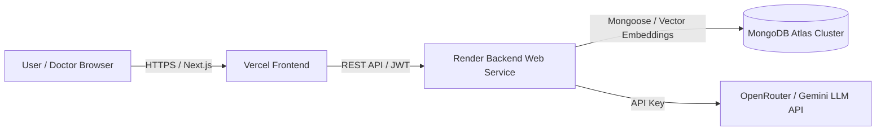

# MedBriefAI: Complete Cloud Production Deployment Guide

This guide provides step-by-step instructions to deploy **MedBriefAI** to production:
- **Frontend:** [Vercel](https://vercel.com) (Next.js 14)
- **Backend:** [Render](https://render.com) (Express API & Multer)
- **Database:** [MongoDB Atlas](https://www.mongodb.com/cloud/atlas) (Cloud Cluster)

---

## 🏗️ Architecture Overview



---

## Step 1: MongoDB Atlas Configuration

1. Log in to [MongoDB Atlas](https://cloud.mongodb.com).
2. Go to **Network Access** $\rightarrow$ **Add IP Address** $\rightarrow$ Select **Allow Access from Anywhere (`0.0.0.0/0`)** (Required for serverless & cloud hosts like Render).
3. Go to **Database Access** $\rightarrow$ Verify database user credentials (e.g., `medbrief_admin`).
4. Copy your Connection String URI:
   ```text
   mongodb+srv://<username>:<password>@cluster0.pc2lhjp.mongodb.net/medbrief_prod?retryWrites=true&w=majority
   ```

---

## Step 2: Deploy Backend to Render

1. Log in to [Render](https://dashboard.render.com).
2. Click **New +** $\rightarrow$ **Web Service**.
3. Connect your GitHub repository: `https://github.com/Siddharth0317/MedBriefAI.git`.
4. Configure service settings:
   - **Name:** `medbrief-ai-backend`
   - **Root Directory:** `server`
   - **Environment:** `Node`
   - **Build Command:** `npm install`
   - **Start Command:** `node src/server.js`
   - **Plan:** Free or Starter
5. Under **Environment Variables**, add:
   | Key | Value | Description |
   | :--- | :--- | :--- |
   | `NODE_ENV` | `production` | Production environment mode |
   | `PORT` | `10000` | Port automatically assigned by Render |
   | `MONGODB_URI` | `mongodb+srv://...` | Your MongoDB Atlas connection string |
   | `JWT_SECRET` | *[Generate a 32+ char random string]* | Secret key for JWT signing |
   | `JWT_EXPIRES_IN` | `7d` | Token validity |
   | `CLIENT_URL` | `https://your-frontend.vercel.app` | Production frontend domain (allow CORS) |
   | `OPENROUTER_API_KEY` | `sk-or-v1-...` | Active OpenRouter API Key |
   | `GEMINI_API_KEY` | *[Optional Gemini Key]* | Gemini AI Studio Key |
6. Click **Create Web Service**.
7. Once deployed, note down your Render URL (e.g., `https://medbrief-ai-backend.onrender.com`).
8. Verify health status: `https://medbrief-ai-backend.onrender.com/api/health`.

---

## Step 3: Deploy Frontend to Vercel

1. Log in to [Vercel](https://vercel.com).
2. Click **Add New...** $\rightarrow$ **Project**.
3. Import your GitHub repository: `MedBriefAI`.
4. In project configuration:
   - **Framework Preset:** `Next.js`
   - **Root Directory:** Edit $\rightarrow$ Select `client`.
5. Under **Environment Variables**, add:
   | Key | Value |
   | :--- | :--- |
   | `NEXT_PUBLIC_API_URL` | `https://medbrief-ai-backend.onrender.com` (Your Render backend URL) |
6. Click **Deploy**.
7. Once Vercel finishes building, copy your production domain (e.g., `https://medbrief-ai.vercel.app`).
8. **Final Step:** Go back to Render $\rightarrow$ Environment Variables $\rightarrow$ Update `CLIENT_URL` with your exact Vercel domain (`https://medbrief-ai.vercel.app`).

---

## Step 4: Verification & Smoke Testing

1. Open your Vercel URL in your browser.
2. Register a new **Patient Account** and submit an intake with symptoms and an attached PDF.
3. Register a new **Doctor Account** and open the **Doctor Consultation Workstation**.
4. Generate the **AI SOAP Briefing**, test the **Interactive RAG Q&A Assistant**, check off clinical actions, and save consultation notes.
5. In both doctor and patient portals, click **Download PDF** to verify official prescription download.
