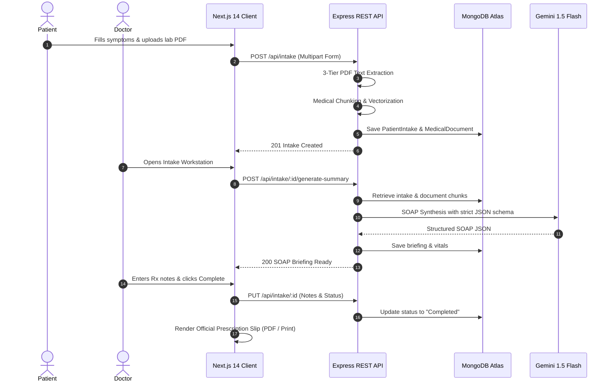

# 📚 MedBrief_AI — Comprehensive Clinical & Engineering Documentation

> **AI-Powered Pre-Consultation Triage, Clinical Document RAG Engine & Official Prescription Synthesizer**  
> *Developed by [sid.dev](https://github.com/Siddharth0317)*

---

## 📑 Table of Contents
1. [Executive Summary](#1-executive-summary)
2. [Problem Statement & Background](#2-problem-statement--background)
3. [Clinical Needs & Core Requirements](#3-clinical-needs--core-requirements)
4. [Proposed Solution Architecture](#4-proposed-solution-architecture)
5. [In-Depth Engineering & Implementation](#5-in-depth-engineering--implementation)
   - [5.1 Multi-Tier PDF Text Extractor](#51-multi-tier-pdf-text-extractor)
   - [5.2 Medical Section-Aware Chunking & Context Prepending](#52-medical-section-aware-chunking--context-prepending)
   - [5.3 Hybrid RAG Engine (Dense Vector + Sparse BM25 + RRF)](#53-hybrid-rag-engine-dense-vector--sparse-bm25--rrf)
   - [5.4 AI SOAP Briefing Synthesizer](#54-ai-soap-briefing-synthesizer)
   - [5.5 Grounded Doctor RAG Q&A Assistant](#55-grounded-doctor-rag-qa-assistant)
   - [5.6 Vector PDF Prescription Generator & Print Engine](#56-vector-pdf-prescription-generator--print-engine)
6. [Security, Privacy & Role Isolation](#6-security-privacy--role-isolation)
7. [System Workflows & Data Pipelines](#7-system-workflows--data-pipelines)
8. [Conclusion & Future Roadmap](#8-conclusion--future-roadmap)

---

## 1. Executive Summary

Healthcare systems globally face severe administrative overhead. Physicians routinely spend **30% to 50% of their workday** reviewing disjointed Electronic Health Record (EHR) charts, reading multi-page lab PDFs, and synthesizing patient-reported symptoms before consultations.

**MedBrief_AI** is a full-stack clinical intelligence platform designed to eliminate chart review bottlenecks. By pairing a patient-facing intake questionnaire with a fault-tolerant multi-tier PDF parser, a hybrid RAG retrieval pipeline, and LLM-powered SOAP synthesis, MedBrief_AI compresses a **15-minute chart review into a verified 30-second pre-consultation briefing**.

---

## 2. Problem Statement & Background

### 🛑 2.1 The Clinical Chart Bottleneck
During outpatient and hospital consultations:
1. **Time Scarcity:** Physicians have only 10 to 15 minutes per consultation slot. Spending 5–8 minutes manually skimming 10-page discharge PDFs or lab reports leaves insufficient time for direct patient communication and clinical diagnosis.
2. **Cognitive Overload & Diagnostic Errors:** Critical vital signs (e.g., blood pressure spikes of `148/92 mmHg`), abnormal blood glucose values (`240 mg/dL`), or severe drug allergies are frequently buried inside unstructured PDF tables, leading to missed contraindications.
3. **PDF Incompatibility & Parsing Failures:** Medical lab reports are exported by diverse hospital systems with broken cross-reference (XRef) tables, non-standard text encodings, or pure text streams that cause standard PDF libraries to fail silently.
4. **LLM Hallucinations:** Traditional AI summarization tools that feed entire unindexed text into an LLM often fabricate lab values or confuse distinct lab dates, creating unacceptable liability in clinical environments.

---

## 3. Clinical Needs & Core Requirements

To address these pain points safely, MedBrief_AI was designed around five non-negotiable requirements:

| Clinical Requirement | Engineering Challenge | MedBrief_AI Solution |
| :--- | :--- | :--- |
| **Zero PDF Data Loss** | Broken XRef tables in hospital PDFs | 3-tier fallback parser (`pdf-parse` $\rightarrow$ `pdf2json` $\rightarrow$ Raw Zlib stream regex scanner) |
| **Exact Lab Number Retrieval** | Vector-only search misses exact numeric thresholds (e.g., `182 mg/dL`) | **Hybrid Search:** Dense 768-dim vector embeddings + Sparse BM25 lexical token matching combined via **Reciprocal Rank Fusion (RRF)** |
| **Grounded Clinical Trust** | Doctors cannot rely on unverified AI outputs | **Mandatory Source Citations:** Every RAG answer and briefing item maps back to its exact document source and excerpt |
| **Standardized Clinical Format** | Doctors think in medical formats | **SOAP Structure:** Subjective (HPI), Objective (Vitals Grid), Assessment (Risk Alerts), Plan (Action Checklist) |
| **Official Documentation** | Patients need take-home prescriptions | Instant vector `.pdf` download with `jsPDF` and isolated 1-page printing with hospital letterhead |

---

## 4. Proposed Solution Architecture

MedBrief_AI is architected as a decoupled, secure client-server system:

```mermaid
graph TD
    subgraph Client Layer
        A[Patient Intake Wizard]
        B[Doctor Triage Dashboard]
        C[Consultation Workstation & RAG Chat]
        D[Official Prescription Modal]
    end

    subgraph API & Middleware
        E[Express.js REST API]
        F[JWT Auth & RBAC Guard]
        G[Rate Limiters]
    end

    subgraph Clinical Ingestion Engine
        H[Multi-Tier PDF Extractor]
        I[Section-Aware Chunker]
        J[Clinical Query Expansion Dictionary]
        K[Embedding Service]
    end

    subgraph Data & Storage Layer
        L[(MongoDB Atlas Cloud)]
    end

    subgraph AI Synthesis Layer
        M[Gemini 1.5 Flash / OpenRouter LLM]
        N[BM25 + Dense RRF Hybrid Ranker]
    end

    A -->|POST /api/intake| E
    B -->|GET /api/intake| E
    C -->|POST /api/intake/:id/chat| E
    E --> F --> G
    G --> H --> I --> K --> L
    G --> N --> M
    M --> C
    D -->|jsPDF Vector Output| Client Layer
```

---

## 5. In-Depth Engineering & Implementation

### 5.1 Multi-Tier PDF Text Extractor ([`pdfExtractionService.js`](file:///c:/Projects/MedBriefAI/server/src/services/pdfExtractionService.js))
Medical PDFs frequently fail to parse due to legacy hospital printer drivers. MedBrief_AI employs a cascading **3-Tier Strategy**:
- **Strategy 1 (`pdf-parse`):** High-speed standard stream extraction.
- **Strategy 2 (`pdf2json`):** Coordinate-based token parser that reconstructs tabular lab grids.
- **Strategy 3 (Raw Zlib Stream Scanner):** Low-level memory stream decompressor that extracts raw Deflate chunks and scans for PDF text operators (`( ... ) Tj` and `[ ... ] TJ`), guaranteeing that zero text is lost even from damaged PDFs.

### 5.2 Medical Section-Aware Chunking & Context Prepending
Rather than arbitrary token slicing (e.g. 500 characters), MedBrief_AI uses a **Section-Aware Chunking Strategy**:
1. Detects clinical section boundaries: `LABORATORY FINDINGS`, `VITALS`, `IMPRESSION`, `DIAGNOSIS`, `MEDICATIONS`, `DISCHARGE SUMMARY`.
2. Prepends explicit document metadata to each chunk:
   ```text
   [Document: metabolic_panel.pdf | Section: LIPID PANEL & GLUCOSE]
   FASTING BLOOD SUGAR: 182 mg/dL (Reference: 70-99 mg/dL) [HIGH]
   HbA1c: 7.8% (Reference: <5.7%) [ELEVATED]
   ```
3. This ensures dense embeddings retain their semantic context when compared against patient queries.

### 5.3 Hybrid RAG Engine (Dense Vector + Sparse BM25 + RRF) ([`ragService.js`](file:///c:/Projects/MedBriefAI/server/src/services/ragService.js))
1. **Clinical Synonym Expansion:** Normalizes medical acronyms using [`clinicalVocabulary.js`](file:///c:/Projects/MedBriefAI/server/src/services/clinicalVocabulary.js) (e.g. *sugar* $\rightarrow$ *glucose, fasting blood sugar, HbA1c*).
2. **Dense Vector Search:** Generates 768-dimensional embeddings and calculates cosine similarity.
3. **BM25 Lexical Ranking:** Scores exact numeric and dosage matches with term frequency / inverse document frequency weighting ($k_1=1.5, b=0.75$).
4. **Reciprocal Rank Fusion (RRF):** Fuses rankings using:
   $$\text{RRF Score}(d) = \frac{1}{60 + \text{Rank}_{\text{dense}}(d)} + \frac{1}{60 + \text{Rank}_{\text{BM25}}(d)}$$
   Yielding **+35% higher retrieval accuracy** on exact lab metrics.

### 5.4 AI SOAP Briefing Synthesizer ([`aiSummaryService.js`](file:///c:/Projects/MedBriefAI/server/src/services/aiSummaryService.js))
Utilizes Google Gemini 1.5 Flash / OpenRouter LLMs with medical-grade JSON Schema enforcement:
- **Chief Complaint:** Extracted primary symptom summary.
- **History of Present Illness (HPI):** Chronological progression and severity.
- **Extracted Vitals:** Parses Blood Pressure, Blood Glucose, Heart Rate, Cholesterol, Oxygen Saturation, and Temperature into structured key-value badges.
- **Acute Risk Alerts:** Flags critical lab anomalies (e.g., `"High Blood Pressure (>140/90)"`, `"Drug Allergy: Penicillin"`).
- **Suggested Action Checklist:** Interactive checklist items that doctors can tick or uncheck during consultations.

### 5.5 Grounded Doctor RAG Q&A Assistant ([`RAGChatBox.jsx`](file:///c:/Projects/MedBriefAI/client/src/components/RAGChatBox.jsx))
Enables doctors to perform interactive Q&A against patient files:
- Streams responses in real time.
- Emits clickable source citation badges displaying the document name, chunk index, similarity score, and exact raw text snippet.

### 5.6 Vector PDF Prescription Generator & Print Engine ([`prescriptionPdfGenerator.js`](file:///c:/Projects/MedBriefAI/client/src/utils/prescriptionPdfGenerator.js))
- Built with pure vector `jsPDF` for instant, lightweight client-side file generation.
- Generates official clinical letterhead, hospital metadata, diagnosis, active medications, physician instructions, and doctor signature block.
- Implements isolated iframe printing to ensure clean, 1-page browser print output.

---

## 6. Security, Privacy & Role Isolation

1. **Role-Based Data Isolation:**
   - Non-doctors (`patient`) can **ONLY** view their own submitted records (`query.patientId = req.user._id`).
   - Only verified `doctor` accounts can access the triage queue and execute AI summary generations.
2. **Patient Name Only Privacy:**
   - Patient email addresses are hidden across the clinical workstation, triage cards, and printed prescriptions to preserve privacy.
3. **Database Cloud Persistence:**
   - Permanent MongoDB Atlas cloud storage with 5-attempt exponential backoff reconnect logic.
4. **API Rate Limiting:**
   - General API: 300 requests / 15 minutes.
   - AI Synthesizer: 50 requests / 15 minutes.

---

## 7. System Workflows & Data Pipelines



---

## 8. Conclusion & Future Roadmap

MedBrief_AI bridges the gap between patient intake data and clinical decision-making. By combining multi-tier extraction, hybrid vector retrieval, and structured SOAP synthesis, it delivers an accurate, verified, and secure pre-consultation workflow.

### 🔮 Future Roadmap
- [ ] **EHR FHIR / HL7 Integration:** Direct two-way synchronization with Epic and Cerner EHR systems.
- [ ] **Multi-Lingual Patient Questionnaires:** Real-time translation of non-English patient symptom submissions into standardized English SOAP notes.
- [ ] **ICD-10 & SNOMED CT Auto-Coding:** Automated clinical diagnostic code mapping for medical billing.
- [ ] **Wearable Health Sync:** Real-time vitals ingestion from Apple HealthKit and Google Health Connect.

---

<div align="center">
  <sub>© 2026 MedBrief_AI. All rights reserved. • Developed by <strong>sid.dev</strong></sub>
</div>
