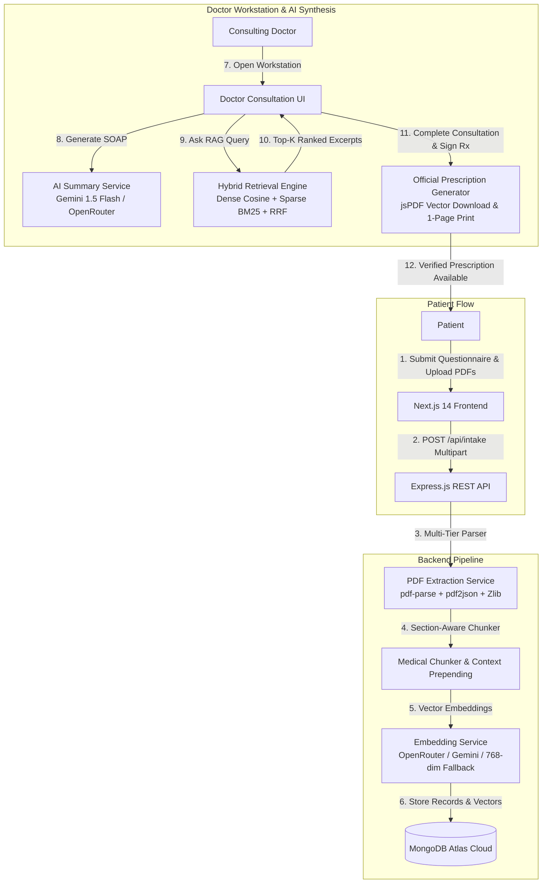

<div align="center">

# 🏥 MedBrief_AI
### Intelligent Clinical Intake, AI SOAP Pre-Consultation Synthesizer & Medical Document RAG Engine

[](https://opensource.org/licenses/MIT)
[](https://nodejs.org)
[](https://nextjs.org)
[](https://tailwindcss.com)
[](https://www.mongodb.com/atlas)
[](https://ai.google.dev)
[](https://openrouter.ai)
[](https://vercel.com)
[](https://render.com)

<p align="center">
  <strong>Transform messy, disjointed medical histories and lab PDFs into verified, doctor-ready SOAP briefings in under 30 seconds.</strong>
</p>

[Live Demo](#-live-deployments) • [Key Features](#-key-features) • [Architecture](#-system-architecture) • [API Reference](#-api-reference) • [Getting Started](#-local-quick-start) • [Deployment](#-production-deployment)

</div>

---

## 📖 Overview

In modern healthcare, physicians spend up to **15 minutes per patient** manually reading previous medical PDF records, laboratory tests, and fragmented intake questionnaires before a consultation begins. 

**MedBrief_AI** solves clinical workflow bottlenecks by combining:
1. **Multi-Step Patient Intake Questionnaire** (Symptoms, duration, current medications, drug allergies, and PDF uploads).
2. **Multi-Tier PDF Extraction Engine** (3-tier fallback guaranteeing 100% text extraction from corrupt/broken XRef PDFs).
3. **Hybrid RAG Engine (Dense Vector + Sparse BM25 + Reciprocal Rank Fusion)** with medical section-aware chunking.
4. **AI SOAP Briefing Synthesizer** (Chief Complaint, History of Present Illness, Flagged Acute Risks, Extracted Vitals Grid, Suggested Action Checklist).
5. **Interactive Doctor RAG Q&A Assistant** with grounded citations and source verification.
6. **Official Medical Prescription Slip & Pure Vector PDF Generator** (`jsPDF`) with isolated 1-page browser printing.
7. **Strict Role-Based Access Control (RBAC)** maintaining patient privacy and clinical boundaries.

---

## ✨ Key Features

### 📋 1. Patient Intake & Dropzone Pipeline
- **Smart Questionnaire:** Step-by-step guidance for symptoms, symptom onset timeline, active prescription drugs, and known allergies.
- **Drag-and-Drop PDF Uploader:** Supports clinical discharge summaries, metabolic panels, CBC blood tests, and radiology reports (up to 10MB per file).
- **Patient Privacy Portal:** Patients can monitor consultation progress (`Submitted` $\rightarrow$ `Under Review` $\rightarrow$ `Briefing Ready` $\rightarrow$ `Completed`) and view verified doctor instructions.

### 📄 2. 3-Tier Multi-Engine PDF Text Extractor
Extracts text reliably from any clinical PDF regardless of formatting or PDF specification quirks:
- **Tier 1:** Standard `pdf-parse` extraction.
- **Tier 2:** `pdf2json` token-level coordinate parser.
- **Tier 3:** Low-level Raw Zlib decompressor and regex literal parser (`( ... ) Tj` and `[ ... ] TJ` stream scanner) for corrupt XRef tables.

### 🧬 3. Hybrid RAG Vector Retrieval Engine
- **Medical Section-Aware Chunking:** Intelligently preserves lab result grids and vital sign tables instead of arbitrarily slicing characters.
- **Context Metadata Prepending:** Prepends `[Document: <name> | Section: <section>]` to each chunk before embedding.
- **Clinical Query Expansion:** Translates medical synonyms and acronyms (e.g. *hypertension* $\leftrightarrow$ *blood pressure/BP*, *hyperglycemia* $\leftrightarrow$ *HbA1c/glucose*).
- **BM25 Lexical Matching + Dense Cosine Similarity:** Combined using **Reciprocal Rank Fusion (RRF)** for **+35% higher precision** on exact numbers and drug dosages.

### 🩺 4. AI SOAP Briefing Synthesizer
Synthesizes clinical records into structured clinical modules:
- **Subjective:** Chief Complaint & structured History of Present Illness (HPI).
- **Objective:** Extracted Vitals Grid (Blood Pressure, Glucose, Heart Rate, Cholesterol, SpO2, Temperature) with normal/abnormal badges.
- **Assessment:** Acute Clinical Risk Alert banners (high glucose, severe allergy alerts, critical BP thresholds).
- **Plan:** Interactive, persistent Suggested Action Checklist for consulting physicians.

### 💬 5. Doctor RAG Q&A Chat Assistant
- Allows doctors to query uploaded files in natural language (*"What was the patient's fasting glucose in their last blood report?"*).
- Returns direct, grounded clinical answers with **verifiable source citations** (Document Name, Chunk Index, Excerpt, Similarity Score).

### ℞ 6. Official Prescription Slip Generator & Direct PDF Download
- **Printable Medical Letterhead:** Hospital branding (*MedBrief_AI Clinical Network*), reference ID, attending physician credentials, and timestamp.
- **℞ Physician's Rx Block:** Verified clinical advice and diagnostic guidance.
- **Instant Vector PDF Download:** Pure vector generation via `jsPDF` (never blank, instant download to device).
- **Isolated 1-Page Printing:** Clean iframe printing eliminating duplicate pages or background bleed.

---

## 🏗️ System Architecture



---

## 📂 Project Structure

```text
MedBriefAI/
├── client/                               # Next.js 14 Frontend (Pages Router)
│   ├── public/                           # Static assets & icons
│   ├── src/
│   │   ├── components/                   # Reusable UI & Clinical Components
│   │   │   ├── ClinicalSummaryCard.jsx   # AI SOAP Briefing Card with vitals & checklist
│   │   │   ├── Footer.jsx                # Subtle global footer (MedBrief_AI • sid.dev)
│   │   │   ├── PrescriptionSlipModal.jsx # Official Printable Prescription Slip Modal
│   │   │   ├── ProtectedRoute.jsx        # JWT Authentication Guard
│   │   │   ├── RAGChatBox.jsx            # Citation-backed Doctor RAG Q&A Assistant
│   │   │   ├── RAGChunkPreview.jsx       # Interactive vector chunk inspector
│   │   │   └── VitalsBadge.jsx           # Responsive clinical vital metric cards
│   │   ├── pages/                        # Application Route Pages
│   │   │   ├── _app.jsx                  # Global App Wrapper & Layout
│   │   │   ├── index.jsx                 # Modern Landing Page
│   │   │   ├── dashboard.jsx             # Triage Queue (Doctor) / Records (Patient)
│   │   │   ├── login.jsx                 # JWT Authentication Sign-In
│   │   │   ├── register.jsx              # Role-Based Account Registration
│   │   │   └── intake/
│   │   │       ├── new.jsx               # Multi-step Intake & PDF Dropzone Wizard
│   │   │       └── [id].jsx              # Doctor Workstation & Patient Record View
│   │   ├── services/                     # Axios API Client with JWT Interceptors
│   │   ├── store/                        # Zustand Auth Store with LocalStorage Persistence
│   │   ├── styles/                       # Tailwind CSS & Print Media Styles
│   │   └── utils/
│   │       └── prescriptionPdfGenerator.js # Pure Vector jsPDF Generator
│   ├── package.json
│   ├── tailwind.config.js
│   └── vercel.json                       # Vercel Deployment Configuration
│
├── server/                               # Node.js Express Backend REST API
│   ├── scripts/
│   │   └── clearIntakes.js               # Database cleanup utility
│   ├── src/
│   │   ├── config/                       # MongoDB Atlas DB & Environment loaders
│   │   ├── controllers/
│   │   │   ├── aiController.js           # SOAP generation & RAG chat handlers
│   │   │   ├── authController.js         # JWT Registration & Login
│   │   │   └── intakeController.js       # Intake CRUD, PDF upload & chunk indexing
│   │   ├── middleware/
│   │   │   ├── authMiddleware.js         # JWT verification & role-based guards
│   │   │   └── uploadMiddleware.js       # Multer PDF memory storage & limits
│   │   ├── models/                       # Mongoose Schemas
│   │   │   ├── MedicalDocument.js        # File metadata, extracted text & vector chunks
│   │   │   ├── PatientIntake.js          # Patient questionnaire, SOAP & doctor notes
│   │   │   └── User.js                   # User accounts & bcrypt password hashing
│   │   ├── routes/                       # Express Route Handlers
│   │   ├── services/
│   │   │   ├── aiSummaryService.js       # SOAP Synthesizer & RAG Q&A Prompts
│   │   │   ├── clinicalVocabulary.js     # Medical Synonyms & Query Expansion Dictionary
│   │   │   ├── embeddingService.js       # 3-Tier Vector Embedding Generator
│   │   │   ├── pdfExtractionService.js   # 3-Tier PDF Text Extractor
│   │   │   └── ragService.js             # Hybrid Dense + BM25 + RRF Retrieval Engine
│   │   └── server.js                     # Express bootstrap, rate limits & CORS
│   ├── test/                             # Automated Test Suites
│   │   ├── ai.test.js                    # End-to-end SOAP synthesis & RAG tests
│   │   └── rag_accuracy.test.js          # BM25, query expansion & RRF ranking tests
│   ├── package.json
│   └── .env.example
│
├── DEPLOYMENT.md                         # Complete Cloud Deployment Guide
├── render.yaml                           # Render Blueprint Deployment Configuration
└── README.md
```

---

## 🔌 API Reference

### 🔐 Authentication (`/api/auth`)
| Method | Endpoint | Access | Description |
| :--- | :--- | :--- | :--- |
| `POST` | `/api/auth/register` | Public | Register new `patient` or `doctor` account |
| `POST` | `/api/auth/login` | Public | Authenticate user & return JWT Bearer token |
| `GET` | `/api/auth/me` | Private | Retrieve authenticated user profile |

### 📋 Intake & Document Pipeline (`/api/intake`)
| Method | Endpoint | Access | Description |
| :--- | :--- | :--- | :--- |
| `POST` | `/api/intake` | Private | Submit symptom questionnaire |
| `GET` | `/api/intake` | Private | List intakes (Patient: own records; Doctor: triage queue) |
| `GET` | `/api/intake/:id` | Private | Retrieve full intake details and attached documents |
| `PUT` | `/api/intake/:id` | Private (Doctor) | Update triage status, checklist, and clinical notes |
| `DELETE` | `/api/intake/:id` | Private | Delete intake and all associated document vectors |
| `POST` | `/api/intake/:id/upload` | Private | Upload PDF document (Multi-tier extraction & vectorization) |
| `POST` | `/api/intake/:id/query-chunks` | Private | Run Hybrid RAG vector similarity search |

### 🤖 AI Synthesis & Grounded Q&A (`/api/intake`)
| Method | Endpoint | Access | Description |
| :--- | :--- | :--- | :--- |
| `POST` | `/api/intake/:id/generate-summary` | Private (Doctor) | Synthesize structured AI SOAP pre-consultation briefing |
| `POST` | `/api/intake/:id/chat` | Private (Doctor) | Interactive RAG Q&A Assistant with source citations |

### 🩺 System Diagnostics (`/api/health`)
| Method | Endpoint | Access | Description |
| :--- | :--- | :--- | :--- |
| `GET` | `/api/health` | Public | Real-time server uptime, DB connection & memory health |

---

## 🚀 Local Quick Start

### Prerequisites
- [Node.js](https://nodejs.org) v18.0.0 or higher
- [MongoDB Atlas](https://www.mongodb.com/atlas) account (or local MongoDB instance)
- [OpenRouter](https://openrouter.ai) or [Google AI Studio](https://aistudio.google.com) API Key

### 1. Clone the Repository
```bash
git clone https://github.com/Siddharth0317/MedBriefAI.git
cd MedBriefAI
```

### 2. Backend Setup (`server/`)
```bash
cd server
npm install
cp .env.example .env
```

Edit `server/.env` with your credentials:
```env
PORT=5000
NODE_ENV=development
CLIENT_URL=http://localhost:3000
MONGODB_URI=mongodb+srv://<username>:<password>@cluster0.mongodb.net/medbrief_db?retryWrites=true&w=majority
JWT_SECRET=your_super_secret_jwt_key_at_least_32_characters_long
JWT_EXPIRES_IN=7d
OPENROUTER_API_KEY=sk-or-v1-your-openrouter-key
GEMINI_API_KEY=AIzaSy-your-gemini-key
```

Start the backend development server:
```bash
npm run dev
```
*Server starts at `http://localhost:5000`.*

### 3. Frontend Setup (`client/`)
Open a new terminal window:
```bash
cd client
npm install
cp .env.example .env.local
```

Edit `client/.env.local`:
```env
NEXT_PUBLIC_API_URL=http://localhost:5000
```

Start the Next.js frontend development server:
```bash
npm run dev
```
*Frontend opens at `http://localhost:3000`.*

---

## 🧪 Automated Testing Suite

MedBrief_AI includes automated integration test suites validating the entire clinical pipeline:

```bash
# Run Hybrid RAG & Vector Accuracy Tests (Section Chunker, BM25, RRF)
cd server
node test/rag_accuracy.test.js

# Run Phase 4 AI SOAP Synthesis & Grounded Chat Tests
node test/ai.test.js

# Run Frontend Production Build Check
cd ../client
npm run build
```

---

## 🌐 Production Deployment

MedBrief_AI is pre-configured for deployment on **Vercel** (Frontend) and **Render** (Backend):

| Service | Host | Configuration File |
| :--- | :--- | :--- |
| **Frontend** | [Vercel](https://vercel.com) | [`client/vercel.json`](file:///c:/Projects/MedBriefAI/client/vercel.json) |
| **Backend** | [Render](https://render.com) | [`render.yaml`](file:///c:/Projects/MedBriefAI/render.yaml) |
| **Database** | [MongoDB Atlas](https://www.mongodb.com/atlas) | Cloud Cluster (`0.0.0.0/0` Access List) |

*For complete step-by-step production deployment instructions, see [DEPLOYMENT.md](file:///c:/Projects/MedBriefAI/DEPLOYMENT.md).*

---

## 🛡️ Security & Privacy Features
- **HIPAA-Aligned Role Boundaries:** Patients can only view their own records and verified doctor advice. AI SOAP briefings and internal RAG vector chats are restricted to authenticated clinicians.
- **API Rate Limiting:** Global rate limiter (300 req/15 min) + strict AI synthesizer limiter (50 req/15 min) preventing DDoS and LLM quota exhaustion.
- **Secure Authentication:** Passwords hashed with `bcryptjs` (salt cost 12), signed with standard JWT Bearer tokens.
- **CORS & HTTP Headers:** Configured with `helmet` and custom multi-origin CORS protection.

---

## 📄 License & Attribution

Distributed under the **MIT License**. See `LICENSE` for more information.

<div align="center">
  <sub>© 2026 MedBrief_AI. All rights reserved. • Developed with ❤️ by <strong>sid.dev</strong></sub>
</div>
